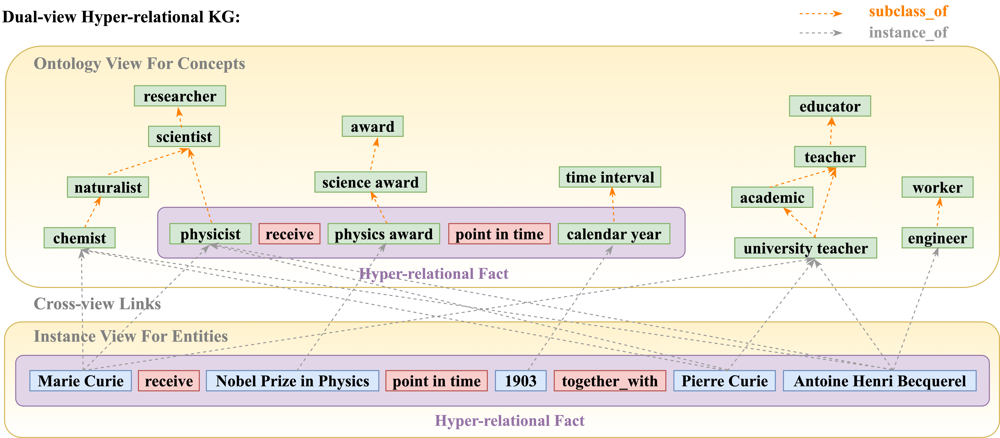

# DHGE
Official resources of **"DHGE: Dual-view Hyper-Relational Knowledge Graph Embedding for Link Prediction and Entity Typing"**. Haoran Luo, Haihong E, Ling Tan, Gengxian Zhou, Tianyu Yao, Kaiyang Wan. **AAAI 2023** \[[paper](https://doi.org/10.48550/arXiv.2207.08562)\].

## Overview
An example of DH-KG structure:


Overall DHGE model:


## Requirements
This project should work fine with the following environments:

- Python 3.7.11 for training & evaluation with:
    -  Pytorch 1.8.1+cu101
    -  numpy 1.20.3
- GPU with CUDA 10.1

All the experiments are conducted on a single 11G GeForce GTX 1080Ti GPU.


## How to Run


### Unzip datasets


```bash
unzip -o -d dataset/ dataset/JW44K-6K.zip
unzip -o -d dataset/ dataset/HTDM.zip
```

### Training & Evaluation

To train and evaluate the DHGE model for tasks of link prediction and entity typing on JW44K-6K dataset, please run:

```bash
python run.py
```

To train and evaluate the DHGE model for tasks of medicine prediction and medicine class prediction on HTDM dataset, please run:

```bash
python run_med.py
```

## BibTex

If you find this work is helpful for your research, please cite:

```bibtex
@article{luo2022dhge,
  title={DHGE: Dual-view Hyper-Relational Knowledge Graph Embedding for Link Prediction and Entity Typing},
  author={Luo, Haoran and E, Haihong and Tan, Ling and Zhou, Gengxian and Yao, Tianyu and Wan, Kaiyang},
  journal={arXiv preprint arXiv:2207.08562},
  year={2022}
}
```

For further questions, please contact: luohaoran@bupt.edu.cn, or wechat: lhr1846205978.
